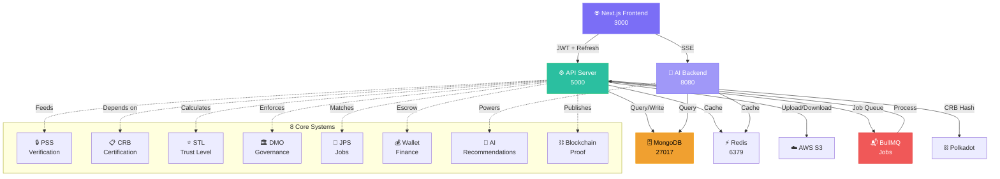
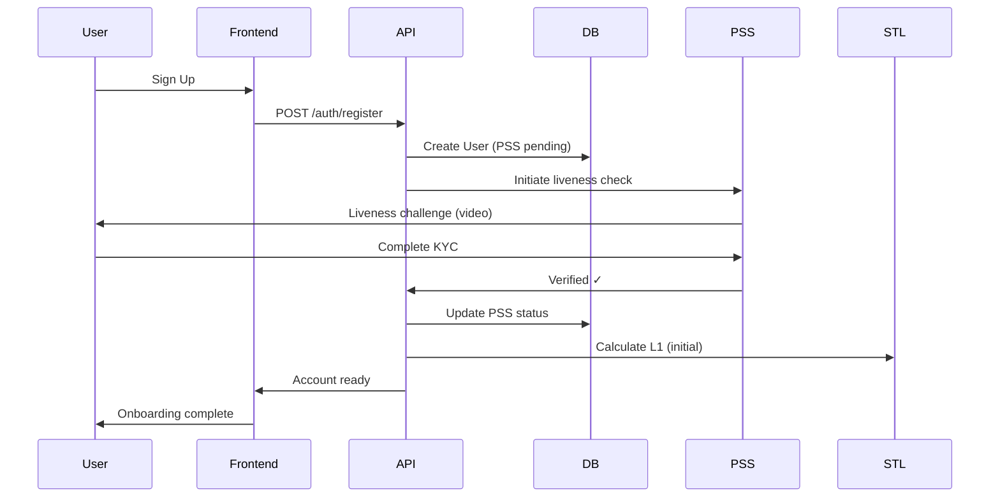

# EHB Documentation Generator Skill

> **Version:** 1.0  
> **Last updated:** 2026-04-14  
> **Owner:** EHB Technologies (Pvt.) Ltd.  
> **Purpose:** Automated generation of API docs, user guides, admin manuals, architecture diagrams, and changelog entries following EHB standards (English for technical, bilingual for user-facing).

---

## §1 — Scope

This skill generates:

1. **API Documentation** — Auto-generated from JSDoc + OpenAPI specs
2. **User Guides** — Per-user-type (Buyer, Seller, Rider, Inspector, Franchise Owner, Admin, Affiliate)
3. **Admin Manuals** — Deep operational reference for platform admins
4. **Architecture Diagrams** — Mermaid syntax, system relationships
5. **Changelog Entries** — Structured format following conventional commits
6. **Module READMEs** — New service/package onboarding
7. **Developer Onboarding Guides** — Getting started for new engineers
8. **Project Status Updates** — ehb-status.json entry generation

---

## §2 — API Documentation Generation

### 2.1 JSDoc-to-OpenAPI Pipeline

Every API endpoint must have:

```javascript
/**
 * Create a product listing
 * @endpoint POST /api/v1/products
 * @role {string[]} seller - Seller or higher
 * @stlMinimum 3 - Service Trust Level L3 minimum
 * @requestBody {object}
 *   - title {string} required - Product name (max 200 chars)
 *   - description {string} - Detailed description
 *   - price {number} required - Price in PKR
 *   - category {string} required - Industry/category slug
 *   - images {string[]} - S3 signed URLs
 * @responseSuccess 201 {object}
 *   - id {string} - Product UUID
 *   - slug {string} - URL-safe slug
 *   - createdAt {timestamp}
 * @responseError 400 {ValidationError}
 * @responseError 403 {object} message: "STL L3+ required"
 * @rateLimit 100 per hour per seller
 * @example
 *   POST /api/v1/products
 *   { "title": "iPhone 15", "price": 250000, "category": "gosellr" }
 *   Response: { "id": "prod_abc123", "slug": "iphone-15" }
 */
```

### 2.2 OpenAPI Spec Template

```yaml
openapi: 3.0.0
info:
  title: EHB API
  version: "1.0.0"
  description: "Global super-app marketplace API"
  contact:
    name: "EHB Dev Team"
    url: "https://ehb.tech/api-support"

servers:
  - url: "https://api.ehb.tech/api/v1"
    description: "Production"
  - url: "http://localhost:5000/api/v1"
    description: "Local development"

paths:
  /products:
    post:
      summary: "Create product listing"
      operationId: "createProduct"
      tags:
        - "Products"
      security:
        - BearerAuth: []
        - STLLevel: ["3"]
      parameters:
        - name: "X-Seller-ID"
          in: "header"
          required: true
          schema:
            type: "string"
      requestBody:
        required: true
        content:
          application/json:
            schema:
              $ref: "#/components/schemas/CreateProductRequest"
      responses:
        "201":
          description: "Product created successfully"
          content:
            application/json:
              schema:
                $ref: "#/components/schemas/ProductResponse"
        "400":
          description: "Validation error"
        "403":
          description: "Insufficient STL level"

components:
  schemas:
    CreateProductRequest:
      type: "object"
      required:
        - title
        - price
        - category
      properties:
        title:
          type: "string"
          maxLength: 200
        description:
          type: "string"
          maxLength: 5000
        price:
          type: "number"
          minimum: 0
        category:
          type: "string"
          enum:
            - "gosellr"
            - "ols"
            - "wms"
            - "hps"
            - "jps"
            - "agts"
        images:
          type: "array"
          items:
            type: "string"
            format: "uri"
          maxItems: 10

  securitySchemes:
    BearerAuth:
      type: "http"
      scheme: "bearer"
      bearerFormat: "JWT"
      description: "Access token (expires 1h)"
    STLLevel:
      type: "apiKey"
      in: "header"
      name: "X-STL-Level"
      description: "Minimum Service Trust Level required"
```

### 2.3 Generating OpenAPI from JSDoc

Command to generate:

```bash
# Using jsdoc-to-openapi or similar
jsdoc -c jsdoc.json --template openapi services/api/stl-replit/routes/

# Output: services/api/openapi.json (committed to repo)
# Frontend serves at: https://localhost:3000/api/docs (Swagger UI)
```

---

## §3 — User Guide Templates

### 3.1 Buyer Guide Structure

**File:** `docs/user-guides/BUYER_GUIDE.md` (Bilingual: English + Roman Urdu)

```markdown
# EHB Buyer Guide
> خریدار کی گائیڈ

## 1. Getting Started / شروعات کریں
- Create account
- Complete PSS verification
- Browse industries

## 2. Search & Discovery / تلاش
- Advanced search filters
- STL level badges (what they mean)
- Seller verification indicators
- Price sorting

## 3. Product Pages / مصنوعات
- Product details layout
- Seller trust card (STL L1-L8)
- Reviews & ratings
- Related products

## 4. Shopping Cart / خریداری ٹوکری
- Add to cart workflow
- Coupon/voucher entry
- Estimated delivery

## 5. Checkout / ادائیگی
- Shipping address
- Payment methods (card, wallet, UPI)
- Escrow explanation
- Order review

## 6. Post-Purchase / خریداری کے بعد
- Order tracking
- Delivery confirmation
- Review writing
- Complaint filing

## 7. Wallet & Credits / والٹ
- Balance view
- Top-up methods
- Transaction history
- Refunds

## 8. Help & Support / معاونت
- FAQ
- Contact support
- Escalation process
```

### 3.2 Seller Guide Structure

**File:** `docs/user-guides/SELLER_GUIDE.md`

```markdown
# EHB Seller Guide
> بیچنے والے کی گائیڈ

## 1. Seller Onboarding / رجسٹریشن
- Account creation
- PSS verification (liveness + KYC)
- CRB certification (business docs)
- Shop setup

## 2. STL Level System / سروس ٹرسٹ لیول
- How STL is calculated
- Your current level (L0-L10)
- Lock requirements (EHBGC)
- How to improve

## 3. Product Management / مصنوعات
- Add product listing
- Bulk upload (CSV template)
- Image optimization
- Category selection
- Pricing strategy

## 4. Order Processing / آرڈرز
- Incoming orders (dashboard)
- Order picking workflow
- Packaging requirements
- Shipment confirmation

## 5. Payments & Wallet / معاوضہ
- Commission breakdown (25% EHB fee)
- Payout schedule (weekly)
- Wallet lock (EHBGC)
- Refund handling

## 6. Growth & Analytics / ترقی
- Sales dashboard
- Top products
- Customer feedback analysis
- Growth recommendations (AI)

## 7. Compliance / قوانین
- Product policy
- Prohibited items
- Return/exchange policy
- Dispute resolution

## 8. Franchise Opportunities / فرنچائز
- Requirements (L5+ STL, 700K EHBGC lock)
- Territory assignment
- Sub-seller onboarding
```

### 3.3 Template for Other User Types

Same structure for:
- **RIDER_GUIDE.md** — Delivery workflow, earnings, STL progression
- **INSPECTOR_GUIDE.md** — Inspection tasks, CRB certification, bonding
- **FRANCHISE_OWNER_GUIDE.md** — Territory, team management, revenue split
- **ADMIN_GUIDE.md** — See §4 below
- **AFFILIATE_GUIDE.md** — Referral tracking, commission tiers

---

## §4 — Admin Manual Template

**File:** `docs/ADMIN_MANUAL.md`

```markdown
# EHB Admin Manual
> Platform Operations & Governance

## 1. Dashboard Overview
- Real-time KPIs (GMV, active sellers, complaints)
- Health monitoring (API, DB, queue)
- User growth trends
- STL distribution chart

## 2. User Management
- Search & filter users by STL, role, status
- Suspend/ban actions (with reason logging)
- Manual STL override (audit trail required)
- Verify PSS/CRB manually if automated fails
- Bulk actions (CSV import)

## 3. Seller Operations
- Seller verification dashboard
- Commission adjustments
- Payout control (hold/release)
- Shop suspension/restoration
- Bulk messaging

## 4. Complaints & Disputes
- Open complaints queue
- Evidence review (photos, chat logs)
- Auto-escalation rules
- Resolution recording
- Refund issuing

## 5. Finance & Audit
- Revenue breakdown (EHB/sellers/franchises)
- Payment reconciliation
- Wallet lock audit (EHBGC)
- Fraud signals (AI module outputs)
- Tax reporting

## 6. Content Moderation
- Flagged products (AI detection)
- Prohibited category enforcement
- Review moderation
- Image moderation

## 7. System Configuration
- Feature flags (STL_V2_ENABLED, etc.)
- Rate limiting tuning
- Industry/category management
- Commission tier changes

## 8. Security & Compliance
- Access logs
- API key rotation
- Backup health
- GDPR/PII data requests
- Incident timeline log

## 9. Reporting & Analytics
- Custom report builder
- Export to CSV/Excel
- Scheduled reports (email)
- Trend analysis
```

---

## §5 — Architecture Diagram Generation

### 5.1 System Architecture (Mermaid)



### 5.2 User Journey (Mermaid)



### 5.3 Generating Diagrams

Command:

```bash
# Install mermaid-cli
npm install -g @mermaid-js/mermaid-cli

# Generate PNG from .md files
mmdc -i docs/architecture.md -o docs/architecture.png

# Generate SVG (for web)
mmdc -i docs/architecture.md -o docs/architecture.svg
```

---

## §6 — Changelog Entry Format

### 6.1 Template

**File:** `CHANGELOG.md` (at repo root)

```markdown
# Changelog

All notable changes to this project will be documented in this file.

## [1.2.0] — 2026-04-14

### Added
- ✨ STL L10 SUPREME tier (10K EHBGC lock, max 100K GMV/month)
- ✨ DMO 8-step approval workflow for franchise promotion
- ✨ Blockchain CRB proof publication (Polkadot mainnet)
- 🎯 Franchise territory conflict detection (AI-powered)
- 🎯 Multi-language support for user guides (English, Urdu, Arabic)

### Changed
- 🔄 PSS verification timeout: 5min → 10min (reduced false fails)
- 🔄 Wallet top-up fee: 2.5% → 2% (seller incentive)
- 📱 Mobile sidebar layout (responsive improvement)

### Fixed
- 🐛 STL decay not applying at 30-day boundary (issue #1247)
- 🐛 Escrow release button sometimes disabled (race condition)
- 🐛 CRB certificate expiry not synced to renewal reminders

### Deprecated
- ⚠️ Legacy 9-level STL system (migrate by 2026-06-30)
- ⚠️ OAuth 1.0 endpoints (use OAuth 2.0 instead)

### Security
- 🔐 Rate limiting: added per-endpoint caps (prevent brute force)
- 🔐 JWT refresh rotation: old tokens blacklisted immediately
- 🔐 File upload validation: MIME type + magic bytes check

### Performance
- ⚡ MongoDB index on `stlLevel` (queries 40% faster)
- ⚡ Lazy load Recharts (initial page load -200ms)
- ⚡ Redis caching for seller stats (TTL 5min)

### Docs
- 📚 Added Seller Guide (bilingual)
- 📚 Updated API docs (OpenAPI 3.0)
- 📚 New admin runbook for STL disputes

### Contributors
- Alice (@alice-dev) — STL L10 formula
- Bob (@bob-designer) — DMO UI redesign
- Carol (@carol-qa) — 58 STL regression tests
```

### 6.2 Structured Changelog Entry (Zod Schema)

```typescript
import { z } from "zod";

const ChangelogEntrySchema = z.object({
  version: z.string().regex(/^\d+\.\d+\.\d+$/), // semver
  date: z.string().datetime(),
  sections: z.record(
    z.enum([
      "Added",
      "Changed",
      "Fixed",
      "Deprecated",
      "Removed",
      "Security",
      "Performance",
      "Docs",
      "Contributors",
    ]),
    z.array(
      z.object({
        emoji: z.enum(["✨", "🔄", "🐛", "⚠️", "🗑️", "🔐", "⚡", "📚", "👥"]),
        text: z.string(),
        issueLinks: z.array(z.string().url()).optional(),
      })
    )
  ),
});
```

---

## §7 — ehb-status.json Update Protocol

### 7.1 Status File Structure

**File:** `ehb-status.json` (at repo root)

```json
{
  "lastUpdated": "2026-04-14T14:30:00Z",
  "buildHealth": {
    "frontend": { "status": "passing", "lastRun": "2026-04-14T14:15:00Z" },
    "api": { "status": "passing", "lastRun": "2026-04-14T14:16:00Z" },
    "ai": { "status": "passing", "lastRun": "2026-04-14T14:17:00Z" }
  },
  "buildPercentages": {
    "frontend": 92,
    "api": 88,
    "ai": 76,
    "integration": 84
  },
  "knownIssues": [
    {
      "id": "stl-l10-formula",
      "severity": "high",
      "description": "STL L10 lock validation missing in franchise flow",
      "assignee": "alice-dev",
      "eta": "2026-04-17"
    }
  ],
  "topPriorities": [
    "Complete STL L10 test coverage (58/58 tests)",
    "DMO 8-step approval workflow UI",
    "Franchise territory conflict detection",
    "CRB Polkadot proof publishing",
    "Multi-language user guides"
  ]
}
```

### 7.2 Update Command

```bash
# Manual refresh
node scripts/ehb-status-update.mjs

# Log a change (auto-adds to ehb-status.log)
node scripts/ehb-log-change.mjs "feat(stl): added L10 SUPREME tier" "complete"
```

### 7.3 Status Schema (Zod)

```typescript
const StatusSchema = z.object({
  lastUpdated: z.string().datetime(),
  buildHealth: z.record(
    z.object({
      status: z.enum(["passing", "failing", "warning"]),
      lastRun: z.string().datetime(),
    })
  ),
  buildPercentages: z.record(z.number().min(0).max(100)),
  knownIssues: z.array(
    z.object({
      id: z.string(),
      severity: z.enum(["low", "medium", "high", "critical"]),
      description: z.string(),
      assignee: z.string().optional(),
      eta: z.string().date().optional(),
    })
  ),
  topPriorities: z.array(z.string()).max(5),
});
```

---

## §8 — README Generation for New Modules

### 8.1 Template for New API Service

**File:** `services/api/<feature>/README.md`

```markdown
# Feature Name

## Overview

Brief description of what this module does.

## Architecture

```
services/api/stl-replit/
├── models/Feature.js           Mongoose schema
├── services/featureService.js   Business logic
├── routes/featureRoutes.js      API endpoints
├── validation/featureSchemas.js  Zod schemas
└── README.md                    (this file)
```

## API Endpoints

### POST /api/v1/features
Create a new feature.

**Request:**
```json
{ "name": "...", "data": {} }
```

**Response:** 201
```json
{ "id": "feature_abc123", "createdAt": "2026-04-14T..." }
```

## Testing

```bash
npm test -- features
npm run test:stl  # If modifies STL
```

## Deployment

1. Code review (2 approvals)
2. Run: `npm run build`
3. Merge to main
4. CI/CD deploys automatically

## Monitoring

- Logs: CloudWatch `/aws/lambda/api`
- Metrics: DataDog dashboard
- Alerts: PagerDuty (if critical)
```

### 8.2 Template for New Frontend Feature

**File:** `apps/web/components/<feature>/README.md`

```markdown
# Feature Component Library

## Components

### Component Name
```tsx
<FeatureCard
  title="Title"
  icon={<IconComponent />}
  stlLevel={5}
  onClick={() => {}}
/>
```

**Props:**
- `title` (string) — Display title
- `icon` (ReactNode) — Lucide icon
- `stlLevel` (0-10) — Optional STL badge
- `onClick` (function) — Click handler

**Accessibility:**
- WCAG 2.1 AA
- Keyboard navigable
- Screen reader friendly

## Design System Integration

Uses tokens from `design-system/EHB-UIUX-SYSTEM.md`:
- Colors: `brand-purple`, `brand-teal`
- Spacing: `gap-4` (Tailwind)
- Border: `border-white/8`
```

---

## §9 — Developer Onboarding Guide Template

**File:** `docs/DEVELOPER_ONBOARDING.md`

```markdown
# New Developer Onboarding — EHB Technologies

## Welcome!

You're joining a team building the world's first AI + blockchain global super-app.

## Day 1: Setup

### 1. Clone & Install
```bash
git clone https://github.com/ehb-tech/ehb-platform.git
cd "EHB DEVELOPMENT 2026"
npm install
```

### 2. Read Core Docs (60 min)
- [ ] `docs/EHB_CONTEXT.md` — Company mission, stack, 8 systems
- [ ] `docs/PROJECT_STRUCTURE.md` — Where code lives
- [ ] `CLAUDE.md` — AI agent rules (you need this!)

### 3. Run Locally
```bash
# From infrastructure/scripts/
./START-LOCAL.bat  # or .sh on macOS/Linux

# Verify:
curl http://localhost:5000/api/health
curl http://localhost:8080/health
open http://localhost:3000
```

### 4. Explore the Code
- [ ] Frontend: `apps/web/app/page.tsx`
- [ ] API: `services/api/stl-replit/routes/`
- [ ] Database schema: `services/api/stl-replit/models/`

## Week 1: Core Learning

### 1. STL System (8-10 hours)
- Read `services/api/stl-replit/services/stlService.js`
- Run tests: `npm run test:stl` (must pass 58/58)
- Understand the formula (§2 of ehb-stl-calculator skill)

### 2. User Flows (4-6 hours)
- Study the 8-step flow (registration → approval)
- Trace a buyer purchase from start to end
- Understand PSS → CRB → STL → DMO chain

### 3. Design System (2-3 hours)
- Read `design-system/EHB-UIUX-SYSTEM.md`
- Read `design-system/ai-behavior.md`
- Copy a component and tweak it

### 4. Security Model (4-5 hours)
- How JWT works (access + refresh)
- How RBAC gates actions
- How wallet locking prevents fraud

## Week 2-4: Contribution

### Pick a Task
- Check `ehb-status.json` for top priorities
- Look at GitHub issues labeled `good-first-issue`
- Pair with a senior dev on your first feature

### Code Review Checklist
- [ ] Tests pass (`npm test`)
- [ ] No hardcoded secrets
- [ ] Follows naming conventions (STL not SQL)
- [ ] Design system compliance
- [ ] Accessible (WCAG 2.1 AA)
- [ ] Comments in English, commits in English

### PR Merge
- 2 approvals minimum
- CI/CD all green
- Merge to main → auto-deploys

## Resources

- **Slack:** #engineering
- **Docs:** https://ehb.tech/docs (internal wiki)
- **Mentor:** Ask your team lead
- **Runbook:** `docs/LAUNCH_GUIDE.md`
```

---

## §10 — Documentation Standards (Bilingual Protocol)

### 10.1 Language Rules

| Content Type | Language | Comment |
|-------------|----------|---------|
| Code (JS/TS) | English | All code must be English |
| Commits | English | Conventional commit format |
| Comments (code) | English | `// Validate PSS liveness check` |
| API docs (OpenAPI) | English | Technical reference |
| Developer docs | English | `docs/*.md` (except guides) |
| **User guides** | **Bilingual** | **English + Roman Urdu side-by-side** |
| **Admin manual** | **English** | **Technical, internal-only** |
| **Marketing copy** | **English** | **Default; i18n hooks for Urdu/Arabic** |
| **Email (user-facing)** | **Bilingual** | **Transactional emails** |
| **Error messages** | **Bilingual** | **UI validation errors** |

### 10.2 User Guide Bilingual Template

```markdown
# Buyer Guide | خریدار کی گائیڈ

## 1. Create Account

**English:**
Visit ehb.tech and click "Sign Up". Enter your email, create a password, and verify your email address.

**Urdu (Roman):**
ehb.tech par jaain or "Sign Up" par click karain. Aapka email enter karain, password banain, aur apne email ko verify karain.

---

## 2. Complete KYC

**English:**
Upload your national ID photo and take a selfie for liveness verification. This takes 2-3 minutes.

**Urdu:**
Apni national ID ki tasveer upload karain aur selfie le kar zindagi ki tasdeeq karain. Yeh 2-3 minit leta hai.
```

### 10.3 API Doc Standard

```markdown
# EHB API Documentation

## Authentication

All endpoints require `Authorization: Bearer <token>` header.

Token is a JWT with 1-hour expiry. Use refresh endpoint to get new token.

### Example

```bash
curl -H "Authorization: Bearer eyJhbGc..." \
  http://localhost:5000/api/v1/me
```

## Error Responses

All errors return JSON:

```json
{
  "error": {
    "code": "VALIDATION_ERROR",
    "message": "Price must be > 0",
    "details": {
      "field": "price",
      "received": -100
    }
  }
}
```

## Rate Limiting

- Public endpoints: 60 req/min per IP
- Authenticated endpoints: 300 req/min per user
- Wallet endpoints: 10 req/min per user (prevent spam)

Headers returned:
- `X-RateLimit-Limit`
- `X-RateLimit-Remaining`
- `X-RateLimit-Reset`
```

---

## §11 — Documentation Tools & Commands

### 11.1 Useful Commands

```bash
# Generate API docs from JSDoc
npm run docs:api

# Generate user guide HTML from markdown
npm run docs:guides

# Generate architecture diagrams
npm run docs:diagrams

# Update ehb-status.json
node scripts/ehb-status-update.mjs

# Log a project change
node scripts/ehb-log-change.mjs "feat(wallet): escrow v2" "in-progress"

# Validate all docs (links, code examples)
npm run docs:validate

# Serve docs locally
npm run docs:serve  # http://localhost:4000
```

### 11.2 Doc File Locations (Decision Tree)

| Document Type | Path | Owner |
|---------------|------|-------|
| API docs | `docs/api/` | Backend team |
| User guides | `docs/user-guides/` | Product + UX |
| Admin manual | `docs/ADMIN_MANUAL.md` | Ops team |
| Architecture | `docs/architecture/` | Tech lead |
| Onboarding | `docs/DEVELOPER_ONBOARDING.md` | HR + Tech lead |
| Changelog | `CHANGELOG.md` | Release manager |
| Status | `ehb-status.json` | CI/CD script |
| Design system | `design-system/` | Design team |
| Skill docs | `.claude/skills/*/SKILL.md` | AI team |

---

## §12 — Auto-Update Protocol

**CRITICAL:** Every time you ship new documentation, update `ehb-status.json`:

```bash
node scripts/ehb-log-change.mjs "docs(guides): added franchise owner guide" "complete"
node scripts/ehb-status-update.mjs
```

Then add a line to `CHANGELOG.md` under Docs section.

---

## §13 — Summary Checklist

When generating documentation:

- [ ] Read `EHB_CONTEXT.md` + `PROJECT_STRUCTURE.md` first
- [ ] Auto-apply STL/CRB naming (SQL→STL, EDR→CRB)
- [ ] User guides are bilingual (English + Roman Urdu)
- [ ] Technical docs are English-only
- [ ] API docs follow OpenAPI 3.0 spec
- [ ] Architecture uses Mermaid syntax
- [ ] Changelog follows conventional commit format
- [ ] Developer onboarding covers first 30 days
- [ ] All code examples are tested/runnable
- [ ] Links are internal-relative (not hardcoded URLs)
- [ ] Update `ehb-status.json` after major docs changes
- [ ] Add entry to `CHANGELOG.md`

---

**Owner:** EHB Documentation Team  
**Last Review:** 2026-04-14  
**Next Review:** 2026-05-14
