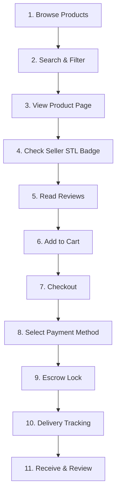
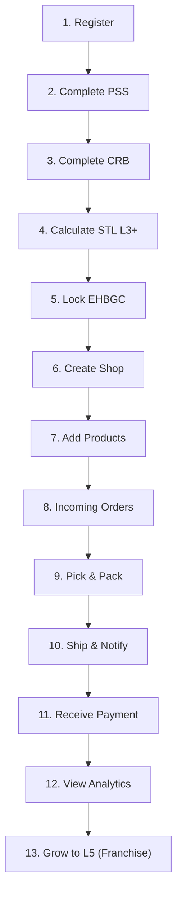
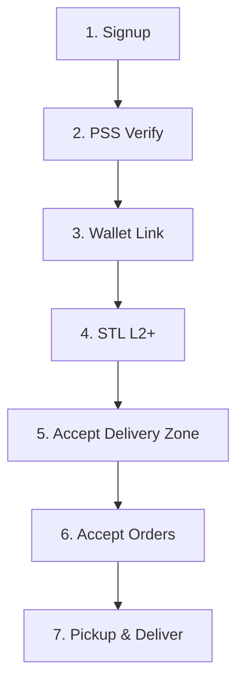
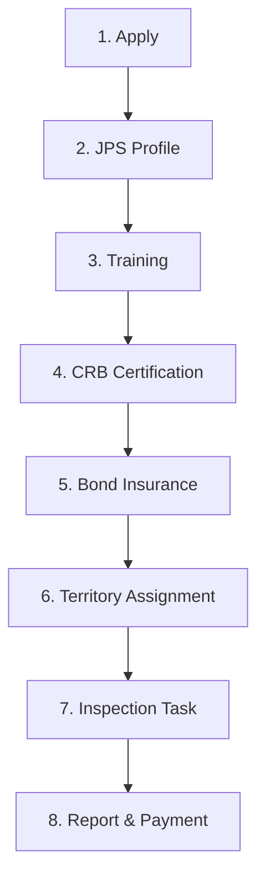
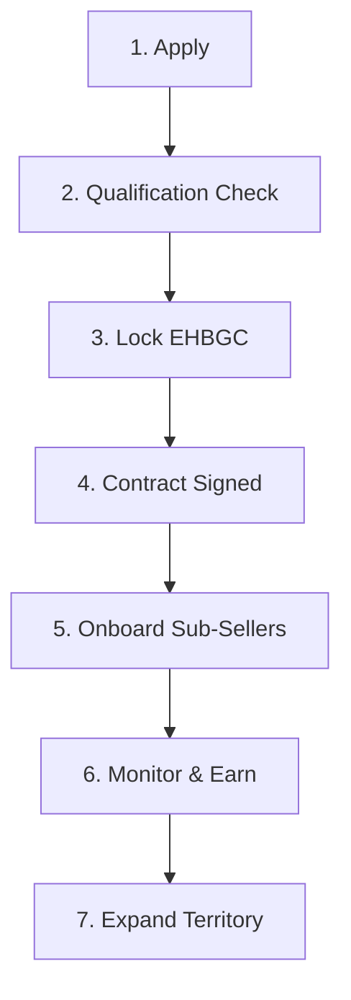

# EHB Flow Validator Skill

> **Version:** 1.0  
> **Last updated:** 2026-04-14  
> **Owner:** EHB Technologies (Pvt.) Ltd.  
> **Purpose:** Validate user flows, detect broken connections, and ensure seamless integration across the platform's 8 core systems.

---

## §1 — The 8-Step Universal Flow

**Every user on EHB must complete this flow to become fully active:**

```
Step 1: Registration
↓
Step 2: JPS (Job Profile & Skill, if applicable)
↓
Step 3: STL (Service Trust Level calculation)
↓
Step 4: PSS (Proof & Security System verification)
↓
Step 5: CRB (Certification & Registry Board docs)
↓
Step 6: DMO (Decentralized Management Office approval)
↓
Step 7: Score (STL finalizes with all data)
↓
Step 8: Active (User can transact)
```

### 1.1 Validation Checklist

```markdown
## Universal 8-Step Flow Validation

### Step 1: Registration ✓
- [ ] User creates account (email + password)
- [ ] Email verification link sent
- [ ] Email confirmed
- [ ] Device fingerprinting captured
- [ ] IP geolocation recorded
- Timeout: 24h for email verification, then account soft-deleted

### Step 2: JPS (Optional for Buyers, Required for Sellers/Riders) ✓
- [ ] User selects role (buyer, seller, rider, inspector, franchise)
- [ ] JPS profile created (skills, certifications, experience)
- [ ] AI recommends matching opportunities
- Timeout: Can skip to Step 3, but limits features

### Step 3: STL Calculation ✓
- [ ] Base L1 score assigned (0-20 points)
- [ ] Activity bonus applied if new member
- [ ] STL Level = L1
- State: Can browse, limited buy/sell

### Step 4: PSS Verification ✓
- [ ] Liveness check initiated (video selfie)
- [ ] KYC form submitted (name, DOB, ID number, address)
- [ ] ID photo + selfie captured
- [ ] Facial recognition: Identity matches ID
- [ ] AML check run (sanctions, watchlist)
- [ ] Device fingerprint checked (no sharing with banned accounts)
- Result: PSS_SCORE (0-40 points)
- Timeout: 5 minutes (can retry 3x/day)
- Status after: L2 TRUSTED (if PSS passed)

### Step 5: CRB Certification ✓
- [ ] Business documents uploaded (only for sellers/franchises)
- [ ] Business registration certificate scanned
- [ ] Tax ID submitted (if applicable)
- [ ] Physical address verified by AI or inspector
- [ ] For sellers: Inspector scheduled to verify address
- [ ] CRB status: PENDING, VERIFIED, REJECTED, EXPIRED
- Result: CRB_SCORE (0-15 points)
- Timeout for inspector: 7 days (escalate to supervisor if missed)
- Status after: L3 VERIFIED (if CRB approved)

### Step 6: DMO Approval ✓
- [ ] User profile reviewed by DMO system
- [ ] Risk assessment: Green/Yellow/Red flag
- [ ] If Yellow/Red: Manual review by admin
- [ ] Appeal mechanism available
- [ ] Approval updates STL + unlocks features
- Status after: Full seller/franchise access

### Step 7: STL Score Finalization ✓
- [ ] PSS + CRB + Behavior + Wallet + Activity + History calculated
- [ ] Penalties + Risk deductions applied
- [ ] Level = L1-L10 assigned
- [ ] Lock requirements enforced
- Status after: User moves to Step 8

### Step 8: Active ✓
- [ ] User can now transact at their STL level
- [ ] Dashboard shows available features
- [ ] Can list products (if seller), accept orders (if rider), etc.
- Starting date recorded for activity scoring
```

---

## §2 — Buyer Flow (11 Steps)



### 2.1 Detailed Buyer Flow

| Step | Action | Data Captured | Duration | Gating |
|------|--------|---------------|----------|--------|
| 1 | Browse | Category, search query | - | L1+ |
| 2 | Search | Filters, sort, price range | - | L1+ |
| 3 | Product Page | Product ID, view time | - | L1+ |
| 4 | View Seller | Seller STL, badge, ratings | - | L1+ |
| 5 | Read Reviews | Review count, avg rating | - | L1+ |
| 6 | Add to Cart | Cart ID, product ID, qty | - | L2+ |
| 7 | Checkout | Shipping address, method | - | L2+ |
| 8 | Payment | Card/wallet/UPI selected | - | L2+ |
| 9 | Escrow Lock | Amount locked, time | - | L2+ |
| 10 | Track | Order status, location | Real-time | L2+ |
| 11 | Review | Rating, comment, photos | - | L2+ |

### 2.2 Buyer Flow Validation

```bash
# Test: Complete buyer purchase journey
npm run test:flow:buyer

# Stages checked:
# ✓ Login → Browse → Search → Product Page → Cart → Checkout → Payment
# ✓ Escrow Lock → Notification (seller) → Shipping → Delivery → Review
# ✓ Verify each step records required data
# ✓ Verify STL gates apply (L2+ for buying)
```

---

## §3 — Seller Flow (13 Steps)



### 3.1 Detailed Seller Flow

| Step | Action | Requirements | Duration | Output |
|------|--------|--------------|----------|--------|
| 1 | Register | Email, password | Instant | User ID |
| 2 | PSS Verify | Liveness, KYC, AML | 5-10 min | PSS_SCORE |
| 3 | CRB Submit | Business docs | 1-7 days | CRB status PENDING |
| 4 | STL L3 | PSS+CRB+Activity | Instant | STL Level L3 |
| 5 | Lock EHBGC | 100K EHBGC minimum | 5 min | Wallet locked |
| 6 | Create Shop | Shop name, description, logo | 10 min | Shop ID |
| 7 | Add Products | Title, price, images, category | 20 min each | Product ID |
| 8 | Incoming Orders | Order notification via SMS/app | Real-time | Order ID |
| 9 | Pick & Pack | Mark order as picked | 1-2 days | Picking confirmed |
| 10 | Ship | Track number entered | 1-7 days | Escrow released to seller |
| 11 | Payment | Weekly payout (75% of order) | 7-14 days | Bank deposit |
| 12 | Analytics | Sales, reviews, rating | Daily | Dashboard |
| 13 | Franchise | Reach L5 (51-60 score) | 6+ months | Franchise eligible |

### 3.2 Critical Sellers-Only Gates

```javascript
// Code: Check if user can sell
const canSell = (user) => {
  return (
    user.stlLevel >= 3 &&                    // L3 VERIFIED minimum
    user.pssVerified &&                      // PSS completed
    user.crbStatus === 'VERIFIED' &&         // CRB verified
    user.walletLocked >= 100000 &&           // 100K EHBGC locked
    !user.isSuspended &&                     // Not banned
    user.pssSince < 30 * 24 * 60 * 60 * 1000 // PSS not expired
  );
};
```

### 3.3 Seller Flow Validation

```bash
npm run test:flow:seller

# Verifies:
# ✓ Register → PSS → CRB → STL L3+ → Lock → Shop → Products → Orders
# ✓ Escrow lock during shipping
# ✓ Payment released after delivery confirmed
# ✓ Commission deducted (25% to EHB, 75% to seller)
# ✓ STL improves with positive activity
# ✓ Complaints apply penalties
```

---

## §4 — Rider Flow (7 Steps)



### 4.1 Detailed Rider Flow

| Step | Action | Requirements | Duration |
|------|--------|--------------|----------|
| 1 | Signup | Email, phone, vehicle info | Instant |
| 2 | PSS | Liveness, KYC, driver license | 10 min |
| 3 | Wallet | Bank account linked for payouts | 5 min |
| 4 | STL L2 | Auto-assigned after PSS | Instant |
| 5 | Zone | Select delivery area (city/zone) | 5 min |
| 6 | Available | Toggle "I'm available to deliver" | Instant |
| 7 | Pickup | Accept order, pickup, deliver, confirm | 30-120 min |

### 4.2 Rider Earnings

```
Per-delivery rate:
- Standard (0-5 km): 150-300 PKR
- Express (same-day): +50%
- Premium zone: +25%
- Night (9pm-6am): +40%

Bonus:
- Acceptance rate >95%: +10%/week
- Rating >4.7 stars: +5%/week
- 50+ deliveries/week: 500 PKR bonus
```

### 4.3 STL Progression for Riders

```
L1 FREE      → 0-20 pts   — Signup only
L2 TRUSTED   → 21-30 pts  — PSS verified, 0 orders
L3 VERIFIED  → 31-40 pts  — 10+ deliveries, >4.5 rating
L4 ACCREDITED → 41-50 pts  — 50+ deliveries, >4.7 rating
L5 CERTIFIED → 51-60 pts   — 200+ deliveries, >4.8 rating, 700K EHBGC lock
```

---

## §5 — Inspector Flow (8 Steps)



### 5.1 Detailed Inspector Flow

| Step | Action | Requirements | Duration |
|------|--------|--------------|----------|
| 1 | Apply | Interest form | Instant |
| 2 | JPS | Skill assessment, experience | 1-2 days |
| 3 | Training | Online course completion | 3-5 days |
| 4 | CRB Cert | License from training body | 5-7 days |
| 5 | Bond | Insurance policy, 50K deposit | 2-3 days |
| 6 | Territory | Assigned zone/region | Instant |
| 7 | Task | Accept inspection job (seller's premises) | 1-3 days |
| 8 | Report | Submit photos + verification report | 24h deadline |

### 5.2 Inspector Compensation

```
Base fee per inspection: 500 PKR
Bonus (if report is high-quality): +250 PKR
Bonus (if 95%+ acceptance rate): +10%/week

CRB renewal: Annually, cost 1,000 PKR
Bond refund: Returned when contract ends (if no claims)
```

---

## §6 — Franchise Owner Flow (7 Steps)



### 6.1 Detailed Franchise Flow

| Step | Action | Requirements | Lock | Duration |
|------|--------|--------------|------|----------|
| 1 | Apply | Application form | - | 1 day |
| 2 | Qualify | STL L5+, business plan, experience | - | 5-7 days |
| 3 | Lock | 700K EHBGC (Master level) | 700K | 3-5 days |
| 4 | Contract | Legal agreement signed, onboarded | - | 5-7 days |
| 5 | Onboard | Recruit & verify sub-sellers | - | Ongoing |
| 6 | Monitor | Dashboard view, support sellers, earn commission | - | 24/7 |
| 7 | Expand | Add more sub-sellers/territories (upgrade to Corporate) | 500K→5M | 6+ months |

### 6.2 Franchise Revenue Split

```
Customer pays 100 PKR

EHB platform:          25 PKR (25% fee)
Sub-Seller:            50 PKR (50%)
Franchise Owner:       20 PKR (20% from sub-seller orders)
[sometimes 15% if Super affiliate]

Franchise upgrades unlock higher commission:
- Sub (50K lock):      15% commission
- Master (200K lock):  20% commission
- Corporate (500K):    25% commission
- Country (1M):        30% commission
```

### 6.3 Franchise Gating

```javascript
const canFranchise = (user) => {
  return (
    user.stlLevel >= 5 &&                    // L5 CERTIFIED minimum
    user.walletLocked >= 700000 &&           // 700K EHBGC locked
    user.pssVerified &&
    user.crbStatus === 'VERIFIED' &&
    user.crbExpiry > now + 30*DAY &&         // CRB expires >30 days
    !user.hasActiveComplaints &&             // No open disputes
    user.averageRating >= 4.7                // 4.7+ stars
  );
};
```

---

## §7 — Admin Flow

No specific steps; admins can:
- View any user's profile
- Manually adjust STL
- Suspend/unsuspend accounts
- Resolve disputes
- Publish content (FAQs, announcements)
- Monitor system health

---

## §8 — Integration Validation (The Three Chains)

### 8.1 Verification Chain: PSS → CRB → STL → DMO

```
User starts registration
↓
PSS Verification (liveness + KYC)
  ├─ If PASSED: Apply 40 pts to STL
  └─ If FAILED: User can retry 3x/day, blocked until passed
↓
CRB Certification (business docs for sellers)
  ├─ If SUBMITTED: Enter "PENDING" state
  ├─ If VERIFIED: Apply 15 pts to STL
  └─ If REJECTED: User can resubmit with corrections
↓
STL Calculation
  ├─ Combine PSS + CRB + Behavior + Wallet + Activity + History
  ├─ Apply Penalties + Risk deductions
  └─ Assign Level L1-L10
↓
DMO Approval (manual step for red-flag users)
  ├─ If GREEN: Auto-approve, unlock features
  └─ If YELLOW/RED: Queue for admin review
↓
User can now transact at their level
```

**Critical validation:**
```javascript
// Must verify this chain never breaks
assert(user.pssVerified || user.stlLevel === 1);  // L1 only if no PSS
assert(user.crbVerified || !user.canSell);        // Can't sell without CRB
assert(user.stlLevel >= 3 || !user.canSell);      // Need L3+ to sell
```

### 8.2 Payment Chain: Order → Escrow → Delivery → Release

```
Customer orders
↓
Payment captured (card/wallet/UPI)
↓
Amount locked in Escrow account (EHB holds it)
↓
Seller notified, picks & ships
↓
Customer receives tracking
↓
Customer confirms delivery
↓
70% released to seller (within 24h)
↓
25% goes to EHB platform fee
↓
5% held 14 days (dispute window)
```

**Critical validation:**
```javascript
// Escrow must be atomic — no partial releases
assert(order.status === 'PAID' && order.escrowAmount > 0);
// Release only if delivery confirmed
assert(order.status === 'DELIVERED' || order.escrowStatus === 'LOCKED');
// Seller can't access money until delivery confirmed
assert(!seller.canWithdraw(escrowAmount) || delivery.confirmed);
```

### 8.3 Complaint Chain: Complaint → Evidence → Review → Resolution

```
Customer files complaint (within 30 days of delivery)
↓
Seller notified, can provide evidence
↓
Evidence collected (photos, chat logs, videos)
↓
Admin or AI reviews evidence
  ├─ If customer right: Refund + seller penalty
  └─ If seller right: Complaint closed, seller unharmed
↓
Escrow released or refunded
↓
Penalty applied to loser's STL (-3 to -5 pts)
↓
System closes complaint
```

---

## §9 — Broken Connection Detection

### 9.1 Red Flags (Auto-Escalate)

```javascript
const detectBrokenConnection = (user) => {
  const issues = [];
  
  // PSS → CRB chain broken
  if (user.pssVerified && !user.crbSubmitted && user.age > 30_days) {
    issues.push('CRB not submitted 30+ days after PSS');
  }
  
  // STL frozen (not updating)
  if (user.lastSTLUpdate < now - 60_days) {
    issues.push('STL not recalculated for 60+ days');
  }
  
  // Escrow stuck
  if (order.escrowStatus === 'LOCKED' && order.age > 14_days) {
    issues.push('Escrow locked for 14+ days, should be released');
  }
  
  // Complaint not resolved
  if (complaint.status === 'OPEN' && complaint.age > 30_days) {
    issues.push('Complaint open >30 days, should be closed');
  }
  
  // DMO approval hanging
  if (user.dmoPending && user.age > 7_days) {
    issues.push('DMO approval pending >7 days, escalate');
  }
  
  return issues;
};
```

### 9.2 Automated Healing

```bash
# Run nightly to fix broken connections
npm run flow:heal-broken-connections

# Actions:
# ✓ Notify users of stuck CRB submissions (send reminder)
# ✓ Force release escrowed funds >14 days old (refund or seller)
# ✓ Auto-close complaints >30 days with no activity
# ✓ Escalate DMO approvals >7 days to supervisor
# ✓ Recalculate STL if last update >60 days old
```

---

## §10 — Flow Diagram Generation (Mermaid)

```bash
# Generate all flow diagrams
npm run generate:flow-diagrams

# Outputs:
# docs/flows/universal-8-step.svg
# docs/flows/buyer-flow.svg
# docs/flows/seller-flow.svg
# docs/flows/rider-flow.svg
# docs/flows/inspector-flow.svg
# docs/flows/franchise-flow.svg
# docs/flows/integration-chain.svg
```

---

## §11 — Flow Validation Checklist Template

```markdown
# User Flow Validation Checklist

## Buyer Flow
- [ ] Can browse without authentication
- [ ] Search filters work
- [ ] Product page loads seller STL correctly
- [ ] Cart adds/removes items
- [ ] Checkout captures address
- [ ] Payment processes (test card)
- [ ] Escrow locks amount correctly
- [ ] Delivery tracking updates
- [ ] Review form captures rating + comment
- [ ] Rating appears on seller profile within 1h

## Seller Flow
- [ ] Register → Email verification
- [ ] PSS liveness check works
- [ ] KYC form validates input
- [ ] CRB document upload (PDF)
- [ ] STL level calculated (≥L3)
- [ ] Shop creation form
- [ ] Product add form
- [ ] Incoming orders notification
- [ ] Order fulfillment workflow
- [ ] Payout calculated (75% of order)
- [ ] Payment released after delivery

## Integration
- [ ] PSS → CRB connection: CRB can't be skipped if seller
- [ ] CRB → STL connection: STL updates when CRB status changes
- [ ] STL → Features: Features gate on STL level
- [ ] Order → Escrow: Money locked before seller ships
- [ ] Delivery → Release: Money only released after confirmed
- [ ] Complaint → Penalty: STL decreases if complaint won

## Monitoring
- [ ] Check ehb-status.json for no "broken connections" alerts
- [ ] Run: npm run test:flow:complete
- [ ] All tests pass: ✓
```

---

## §12 — Summary

**Key Rules:**

1. **8-Step flow is mandatory** — Every user must complete all steps
2. **Verify chains never break** — PSS→CRB→STL→DMO, Order→Escrow→Release, Complaint→Review→Resolve
3. **STL gates features** — Seller can't list without L3+, franchise can't start without L5+
4. **Escrow is atomic** — Money locked until delivery confirmed
5. **MIN rule applies** — Final STL = MIN(product, seller, company, owner)
6. **Test flows regularly** — `npm run test:flow:complete` before every release

---

**Maintainer:** Product Team  
**Last Review:** 2026-04-14  
**Next Review:** 2026-05-14
