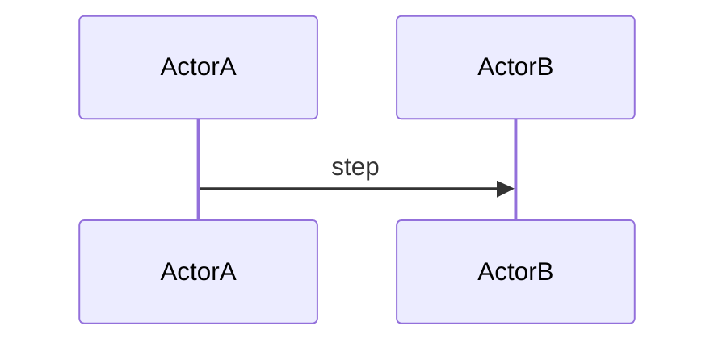

# Design flow doc — template

> Copy this file for each new flow (`docs/flows/<FLOW_ID>_<short-title>.md`).  
> Naming: `FLOW-###` optional prefix, kebab-case title.

## Metadata

| Field | Value |
|-------|--------|
| **Flow ID** | e.g. FLOW-001 |
| **Title** | |
| **Status** | Draft \| Review \| Approved |
| **Owner** | |
| **Last updated** | YYYY-MM-DD |
| **Source plans** | Link to `docs/development/EHB_*_PLAN.md` rows |

## Summary

2–4 sentences: user/system goal, start trigger, end state.

## Actors

| Actor | Description |
|-------|-------------|
| | |

## Preconditions / inputs

- 

## Flow (steps)

1. 
2. 

## Diagrams

## Screen / view inventory

| Screen or route | Purpose | Notes |
|-----------------|---------|-------|
| | | |

## Data / events (design level)

| Input | Output | Trigger |
|-------|--------|---------|
| | | |

## Open questions

- 

## Assumptions

- 

## Traceability

| Plan file (docs/development/) | Section or topic covered |
|------------------------------|--------------------------|
| | |

---

*Template aligned with EHB design-flow phases (P0–P11). Master: [EHB_MASTER_SYSTEM_PLAN.md](../development/EHB_MASTER_SYSTEM_PLAN.md).*
