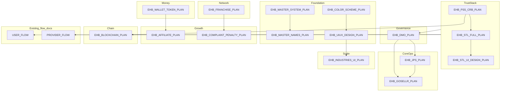

# EHB module dependency (design)

> High-level order for **design + flow** work. Downstream modules assume upstream trust and identity concepts are stable.  
> Source: [EHB_MASTER_SYSTEM_PLAN.md](../development/EHB_MASTER_SYSTEM_PLAN.md), ecosystem references.

## Reading order (recommended)

1. Master + names + color + UI/UX (foundation)
2. PSS/CRB → STL → STL UI (trust)
3. DMO (oversight)
4. JPS → GoSellr (people + commerce)
5. Wallet → Franchise → Affiliate + Complaint
6. Blockchain (trust anchoring design)
7. Industries UI (scale)

---

*P0 artifact — revise when a plan file changes materially.*
