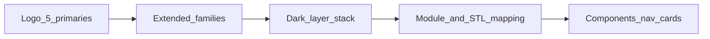

# FLOW-P1 — Foundation UI: color + design system

## Metadata

| Field | Value |
|-------|--------|
| **Flow ID** | FLOW-P1 |
| **Title** | Foundation — EHB color scheme + UI/UX design plan alignment |
| **Status** | Draft |
| **Owner** | EHB design-flow |
| **Last updated** | 2026-04-07 |
| **Source plans** | [EHB_COLOR_SCHEME_PLAN.md](../development/EHB_COLOR_SCHEME_PLAN.md), [EHB_UIUX_DESIGN_PLAN.md](../development/EHB_UIUX_DESIGN_PLAN.md), [EHB_MASTER_SYSTEM_PLAN.md](../development/EHB_MASTER_SYSTEM_PLAN.md) §21 |

## Summary

EHB’s visual foundation is **logo-extracted primaries** plus **dark theme layers** ([EHB_COLOR_SCHEME_PLAN.md](../development/EHB_COLOR_SCHEME_PLAN.md)), applied through **usage maps, STL badges, gradients, typography, and components** ([EHB_UIUX_DESIGN_PLAN.md](../development/EHB_UIUX_DESIGN_PLAN.md)). This doc is the **single design-flow anchor** for P1; full token tables remain in the two source files.

## Actors

| Actor | Description |
|-------|-------------|
| Designer / PM | Reads plans, maintains flow docs and traceability |
| Future dev | Implements tokens (CSS/Tailwind) from canonical hex |

## Preconditions

- [EHB_MASTER_SYSTEM_PLAN.md](../development/EHB_MASTER_SYSTEM_PLAN.md) v7.0 DOCUMENT INDEX lists both color and UI/UX plans.

## Canonical colors (5 logo + platform extensions)

| Role | Hex | Notes |
|------|-----|--------|
| Education Red | `#CC2200` | L1 FREE, danger, education modules |
| Health Blue | `#29ABE2` | Primary CTA, AI, L3 TRUSTED, links |
| Business Green | `#22B14C` | GoSellr primary, success, L5 with gold |
| Energy Orange | `#F7941D` | Wallet/EHBGC accent, L2 BASIC, warnings |
| Power Black | `#231F20` | Logo text, strong headlines |
| Platform Purple | `#7C3AED` | L4 PREMIUM, premium locks |
| VIP Gold | `#F59E0B` | L5 crown, HQ franchise |
| Tech Teal | `#06B6D4` | AI features (per UIUX Part 1) |

## Dark surfaces (stack)

Deepest → surface: `#080A10` → `#0D1017` → `#111622` → `#181E2E` (card) → `#1E2638` (hover) → `#252D40` (inputs). Borders: default `rgba(255,255,255,0.06)`; active focus tied to Health Blue / Premium Green per color plan.

## Text

| Token | Hex |
|-------|-----|
| Primary | `#FFFFFF` |
| Body | `#B0BAD3` — **canonical** ([EHB_COLOR_SCHEME_PLAN.md](../development/EHB_COLOR_SCHEME_PLAN.md) Part 4 Text Secondary). [EHB_UIUX_DESIGN_PLAN.md](../development/EHB_UIUX_DESIGN_PLAN.md) Part 2 updated to match. **Code:** `textBody` / `textMuted` are **implemented** under `theme.extend.colors.ehb` in [`EHB landing-2026/tailwind.config.ts`](../../EHB%20landing-2026/tailwind.config.ts); prefer `text-ehb-textBody` over `text-slate-300` and `text-ehb-textMuted` over `text-slate-400` when touching components. |
| Muted | `#6B7A99` |

### Tailwind (implemented)

Classes: `text-ehb-textBody`, `text-ehb-textMuted` (see `colors.ehb` in `tailwind.config.ts`). **Full rollout:** every `app/**/*.tsx` and `app/**/*.ts` and every `components/**/*.tsx` under the landing app now use these tokens instead of `text-slate-300` / `text-slate-400` (including root `layout`, AI marketplace, search, cart, certification, profile, industries/landing routes, PSS drawer, super-app chrome, shared `components/ui/*`, and API route strings such as `app/api/gosellr/trust/route.ts`). **Second pass (routes + libs):** remaining `text-slate-100` / `text-slate-200` / `text-slate-500` / `text-slate-600` in `app/` and `components/` were mapped to `text-white` / `text-ehb-textBody` / `text-ehb-textMuted`; gradient CTAs keep **`text-slate-950`**, light chip fills keep **`text-slate-900`** where contrast requires it. **`lib/`** string maps: [`lib/content/homepage.ts`](../../EHB%20landing-2026/lib/content/homepage.ts) (`toneClass` on info cards), [`lib/agents/catalog.ts`](../../EHB%20landing-2026/lib/agents/catalog.ts) (e.g. idle runtime badge), and **`lib/industry/verificationStandards.ts`** (SILVER badge: `text-ehb-textBody`, `border-ehb-textMuted/40`). Earlier milestones (DMO, admin, dashboard, franchise, etc.) are included in this sweep. **OLS law reference tree:** the same text-token replacements are applied under [`content/industries/law/ols-law-source/nextjs-app/src`](../../EHB%20landing-2026/content/industries/law/ols-law-source/nextjs-app/src) for parity when copying components. That app uses Tailwind v4 `@theme` in [`globals.css`](../../EHB%20landing-2026/content/industries/law/ols-law-source/nextjs-app/src/app/globals.css) (`--color-ehb-textBody`, `--color-ehb-textMuted`) so `text-ehb-textBody` / `text-ehb-textMuted` resolve when the OLS package is built standalone; gold/white CTAs keep **`text-slate-900`**. Tailwind `content` in [`tailwind.config.ts`](../../EHB%20landing-2026/tailwind.config.ts) includes `app/`, `components/`, **`lib/`** (string-based `className` maps), and the OLS law mirror path, so JIT emits `text-ehb-*` and related utilities.

**Deploy check:** `GET /api/health` → `{ ok, service, gitSha? }` ([`app/api/health/route.ts`](../../EHB%20landing-2026/app/api/health/route.ts)); covered by [`tests/health.test.ts`](../../EHB%20landing-2026/tests/health.test.ts).

**Docs index:** [`docs/INDEX.md`](../INDEX.md) includes a **Static assets** pointer to [`EHB landing-2026/README.md` — Static assets](../../EHB%20landing-2026/README.md#static-assets) (`public/images/`, `designAssets.ts`, `gosellrProducts.ts`, `next/image`).

## STL badge → color (UIUX Part 1)

| Level | Mapping |
|-------|---------|
| L1 FREE | Education Red `#CC2200` |
| L2 BASIC | Energy Orange `#F7941D` |
| L3 TRUSTED | Health Blue `#29ABE2` |
| L4 PREMIUM | Platform Purple `#7C3AED` |
| L5 VIP ELITE | Gold → Green gradient `#F59E0B` → `#22B14C` |

## Module → brand color (excerpt)

See [EHB_COLOR_SCHEME_PLAN.md](../development/EHB_COLOR_SCHEME_PLAN.md) Part 5 for full lists: e.g. GoSellr → Business Green; JPS/Education/PSS → Education Red; Health services → Health Blue; Wallet/EHBGC → Energy Orange; DMO info panels → Health Blue; Affiliate earnings → Business Green.

## Typography (UIUX Part 2)

- Headings: Inter or Plus Jakarta Sans  
- Body: Inter  
- Numbers: JetBrains Mono or Roboto Mono  
- Scale: H1 48px / H2 32px / H3 20px / body 16px / caption 13px / badge 11px  

## Philosophy (non-negotiable checks)

- **5 second rule:** what EHB is, what user can do, where to click — [EHB_UIUX_DESIGN_PLAN.md](../development/EHB_UIUX_DESIGN_PLAN.md) opening section  
- **3 second test:** identity, options, first action  

## Diagrams

## Screen / view inventory (P1 scope)

| Area | Purpose |
|------|---------|
| Global | Sidebar, header, mobile nav (ASCII refs in UIUX Part 3) |
| Cards | Product, job, franchise, wallet (Part 3) |
| Badges | STL L1–L5, LIVE, Coming Soon |

*Detailed ASCII wireframes: source UIUX plan — do not duplicate here.*

## Open questions

- Urdu/RTL: mirror rules for nav (UIUX may add later).  

## Traceability

| Plan file | Section or topic covered |
|-----------|-------------------------|
| EHB_COLOR_SCHEME_PLAN.md | Parts 1–6+ primaries, text, module map, gradients |
| EHB_UIUX_DESIGN_PLAN.md | Philosophy, Part 1 usage/gradients, Part 2 type, Part 3+ components |
| EHB_MASTER_SYSTEM_PLAN.md | §21 summary, DOCUMENT INDEX |

---

*FLOW-P1 | P1 foundation for downstream P2–P11 flow docs.*
