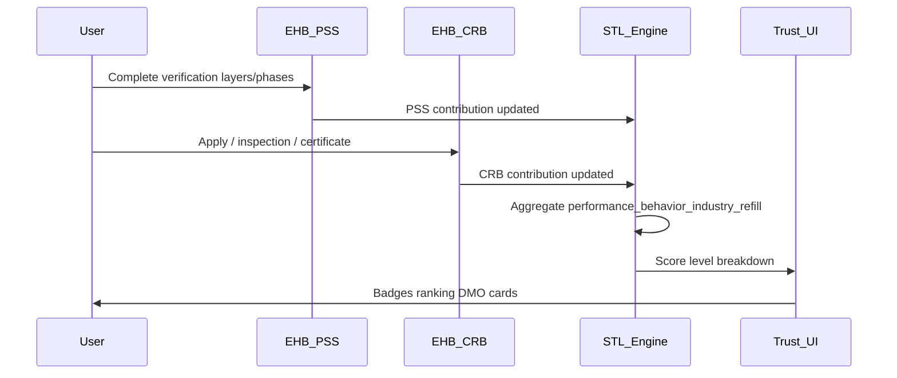

# FLOW-P2 — Trust stack: PSS, CRB, STL engine, STL UI

## Metadata

| Field | Value |
|-------|--------|
| **Flow ID** | FLOW-P2 |
| **Title** | Integrated trust pipeline — verification → certification → score → surfaces |
| **Status** | Draft |
| **Owner** | EHB design-flow |
| **Last updated** | 2026-04-07 |
| **Source plans** | [EHB_PSS_CRB_PLAN.md](../development/EHB_PSS_CRB_PLAN.md), [EHB_STL_FULL_PLAN.md](../development/EHB_STL_FULL_PLAN.md), [EHB_STL_UI_DESIGN_PLAN.md](../development/EHB_STL_UI_DESIGN_PLAN.md) |

## Summary

**PSS (Proof & Security System)** identity aur device trust establish karta hai (0–40 points toward STL per engine). **CRB (Central Record Blockchain)** physical / role certification add karta hai (0–20 cap). **STL (Service Trust Level)** in inputs plus performance, behavior, industries, refilling ko combine karke **0–100** score aur **L1–L5** level banata hai. **STL UI** DMO dashboards, user “My Trust” page, aur marketplace cards par yahi score dikhata hai. Ye doc **design-flow** anchor hai; implementation status `EHB_STL_FULL_PLAN` §2 mein.

## Preconditions

- User or entity registered; PSS phases/layers start.
- CRB path jahan applicable (seller, inspector, franchise, etc.).

## Main sequence (happy path)

## PSS → STL (two views in plans — align at build)

| Source | Model |
|--------|--------|
| [EHB_PSS_CRB_PLAN.md](../development/EHB_PSS_CRB_PLAN.md) | **5 layers** with per-layer points (max +40 sum) |
| [EHB_STL_FULL_PLAN.md](../development/EHB_STL_FULL_PLAN.md) §3 | Engine **PSS 0–40** by **phase** (Phase 0→0, Phase 1→30, Phase 2+→40 cap) |

**Design rule:** Single source for production = **STL engine** (`lib/stl` per §2); PSS plan layers describe **UX steps** that must map to those phases. Document mapping in implementation; **open question** until PM/eng confirms.

## CRB → STL

- Per active certificate: base + bonus; cap **20** total for CRB component ([EHB_STL_FULL_PLAN.md](../development/EHB_STL_FULL_PLAN.md) §3).
- Behavior sub-score ties to latest inspection outcomes (fraud, score bands).

## STL engine components (v1 — §3)

| Component | Range | Role |
|-----------|-------|------|
| PSS | 0–40 | Identity depth |
| CRB | 0–20 | Certification |
| Performance | 0–20 | Orders, services |
| Behavior | -50–20 | Inspection + fraud |
| Industries | 0–20 | Multi-industry verification |
| Refilling | -40–10 | Re-verification lifecycle |

**Level bands (engine):** L1 0–39 | L2 40–59 | L3 60–74 | L4 75–89 | L5 90–100.

**UI color labels (L1–L5)** — [FLOW-P1-foundation-ui.md](FLOW-P1-foundation-ui.md); badge copy **EHB-STL-LEVEL** per [GLOSSARY_EHB.md](GLOSSARY_EHB.md).

## Auto-recalc triggers (design hooks — §6)

| # | Event | Typical reason code |
|---|--------|---------------------|
| 1 | PSS phase complete | `PSS_PHASE_COMPLETED` |
| 2 | CRB certificate active | `CRB_CERTIFICATE_ISSUED` |
| 3 | Order delivered | `ORDER_DELIVERED` |
| 4 | Review submitted | `REVIEW_SUBMITTED` |
| 5 | Industry verification changed | `INDUSTRY_VERIFICATION_CHANGED` |
| 6 | Refilling status changed | `REFILLING_STATUS_CHANGED` |
| 7 | Fraud signal | `FRAUD_SIGNAL_IMPACT` |

## Screen / view inventory (STL UI plan)

| Location | Purpose |
|----------|---------|
| DMO main dashboard | At-a-glance + STL distribution + quick panels ([EHB_STL_UI_DESIGN_PLAN.md](../development/EHB_STL_UI_DESIGN_PLAN.md) Q1) |
| `/dmo/stl` (STL sub-panel) | Ranking, history, manual calc; **planned adds:** override, freeze, appeals queue, bulk recalc, graphs |
| User STL page | Score, breakdown bars, next level ([EHB_STL_UI_DESIGN_PLAN.md](../development/EHB_STL_UI_DESIGN_PLAN.md) Q2) |
| GoSellr cards | Seller/product STL badges |
| Trust Card / public profile | Planned |

**Already built (per STL full plan §2):** engine, `api/stl/*`, DMO STL page, `StlWidget`, Prisma models — **gaps** (badges, hooks, appeals, etc.) §2 “Missing” list.

## Appeal flow (summary — §7)

User submit → pending → DMO review → APPROVED (adjust/recalc) / REJECTED → notify → audit.

## Open questions

- STL UI badge colors (FLOW-P1) vs engine table “Yellow-Green” for L3 — use **color plan** as canonical for UI.
- Wallet limits / commission table (§4 benefits) vs `EHB_WALLET_TOKEN_PLAN` — see [ECONOMICS_MASTER.md](ECONOMICS_MASTER.md) §5 + [FLOW-P6](FLOW-P6-wallet-token.md).

**Resolved:** PSS layers vs engine — [PSS_TO_STL_ENGINE_MAPPING.md](PSS_TO_STL_ENGINE_MAPPING.md).

## Traceability

| Plan file | Topics covered |
|-----------|----------------|
| EHB_PSS_CRB_PLAN.md | PSS layers, CRB sections, PSS→STL narrative |
| EHB_STL_FULL_PLAN.md | Formula, levels, triggers, gaps, APIs/UI plan refs |
| EHB_STL_UI_DESIGN_PLAN.md | DMO + user STL pages, cards, icons |

---

*FLOW-P2 | Trust stack design anchor for P3 DMO.*
