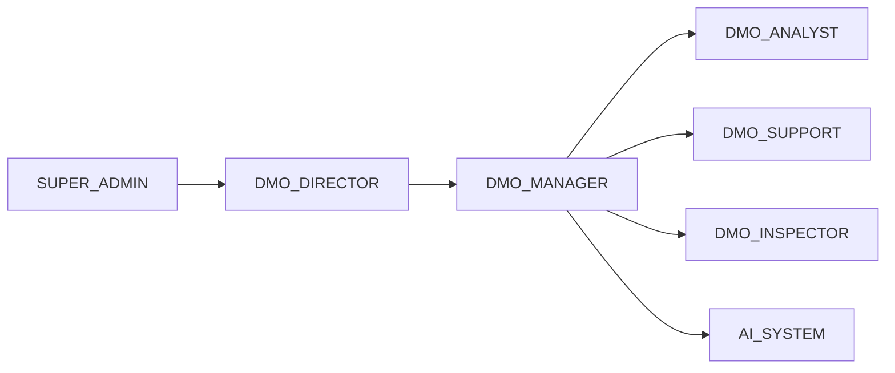

# FLOW-P3 — EHB-DMO governance

## Metadata

| Field | Value |
|-------|--------|
| **Flow ID** | FLOW-P3 |
| **Title** | Decentralized Management Office — oversight, roles, modules, automation |
| **Status** | Draft |
| **Owner** | EHB design-flow |
| **Last updated** | 2026-04-07 |
| **Source plans** | [EHB_DMO_PLAN.md](../development/EHB_DMO_PLAN.md) |

## Summary

**EHB-DMO (Decentralized Management Office)** platform ka **governance brain** hai: day-to-day operations run nahi karta, lekin **approve, monitor, enforce, audit** karta hai across GoSellr, JPS, PSS, CRB, STL, Franchise, Wallet, Complaints, Affiliate. Staff + **AI automation** mil kar chalate hain. Ye doc **design-flow** anchor hai; UI routes **EHB landing-2026** `DmoSectionWorkspace` se align kiye gaye hain.

## DMO role hierarchy (plan Part 2)

| Code | Function (short) |
|------|------------------|
| SUPER_ADMIN | Full policy, bans |
| DMO_DIRECTOR | Heads DMO |
| DMO_MANAGER | Per-module ownership |
| DMO_ANALYST | Monitoring, reports |
| DMO_SUPPORT | Complaints, user support |
| DMO_INSPECTOR | CRB/PSS audit oversight |
| AI_SYSTEM | Automated scoring / routing |

## Module panels (plan Part 4) ↔ workspace sections

[EHB_DMO_PLAN.md](../development/EHB_DMO_PLAN.md) describes **what DMO does** per module. Demo app groups routes under `DmoSectionWorkspace` (`components/dmo/DmoSectionWorkspace.tsx`):

| Plan panel | DMO focus (summary) | Workspace `key` | Base route |
|------------|----------------------|-------------------|------------|
| PSS | Flagged ID review, blacklist | `pss` | `/dmo/pss` |
| CRB | Certificates, inspections, appeal | `crb` | `/dmo/crb` |
| STL | Override, freeze, appeals, bulk recalc | `stl` (label **EHB-STL**) | `/dmo/stl` |
| GoSellr | Listings, commissions, seller bans | *(plan; map to industry/ops as product matures)* | — |
| JPS | Designations, exams, contracts | `jps` | `/dmo/jps` |
| Franchise | Applications, KPIs, audits | `franchise` | `/dmo/franchise` |
| Wallet & AML | AML queue, large withdrawals | *(dedicated wallet section TBD in workspace)* | — |
| Complaints | Tier 5+6, penalties | `penalty` / notifications patterns in data | — |
| Applications / approvals | Intake workflows | `applications`, `approvals` | `/dmo/applications`, `/dmo/approvals` |
| Industry | Verification queue | `industry` | `/dmo/industry` |
| Automation | Rules, triggers, fraud | `automation` | `/dmo/automation` |
| Refilling | 6-month cycle | `refilling` | `/dmo/refilling` |
| Affiliate | *(plan Part 4 extension)* | `affiliate` | `/dmo/affiliate` |

**EHB-STL sub-views:** `scores` | `breakdown` | `history` | `ranking` — [FLOW-P2-trust-stack.md](FLOW-P2-trust-stack.md) ke STL UI gaps ke sath align karein.

## Overview dashboard flow (plan Part 3)

1. Load **today stats** (users, orders, complaints, CRB, STL alerts, fraud).
2. Surface **critical alerts** (fraud, AML, complaint tier, STL override).
3. **Quick links** to PSS / CRB / Complaint / STL / Franchise / Wallet queues.
4. Optional **STL distribution** (L1–L5).

## Automation layer (plan Part 5)

| Category | Examples |
|----------|----------|
| Fully automated | STL recalc on order; fraud signal if STL low; SLA breach escalate; duplicate complaint merge; CRB expiry reminder |
| Human required | PSS manual review; CRB final cert; STL override; franchise termination; bans; high-risk AML; Tier 5+ complaints |
| Hybrid | AI proposes → human confirms (appeals, complaints, franchise) |

## RBAC excerpt (plan Part 8)

| Action | SUPER | DIRECTOR | MANAGER | ANALYST | SUPPORT |
|--------|-------|----------|---------|---------|---------|
| Override STL | Yes | Yes | Limited | No | No |
| Ban account | Yes | Yes | No | No | No |
| Approve CRB | Yes | Yes | Yes | No | No |
| Resolve complaint | Yes | Yes | Yes | Yes | Yes |

Full matrix: source plan.

## Audit trail (plan Part 9)

Har sensitive action: **actionType**, **actor**, **target**, **previous/new value**, **reason (required)**, timestamp, IP/session; high-risk → optional blockchain hash (plan).

## Cross-flow links

| Topic | Flow doc |
|-------|----------|
| STL score, triggers, DMO STL tools | [FLOW-P2-trust-stack.md](FLOW-P2-trust-stack.md) |
| Colors / badges | [FLOW-P1-foundation-ui.md](FLOW-P1-foundation-ui.md) |
| Naming | [GLOSSARY_EHB.md](GLOSSARY_EHB.md) |

## Open questions

- GoSellr + Wallet **dedicated** DMO routes vs nested under existing sections — product decision.
- `penalty` / complaint **tier** views: confirm final URL list vs plan Part 4.8.

## Traceability

| Plan file | Topics |
|-----------|--------|
| EHB_DMO_PLAN.md | Parts 1–10: roles, dashboards, panels, automation, reporting, comms, RBAC, audit, advanced |

---

*FLOW-P3 | DMO governance design anchor for P4 JPS.*
