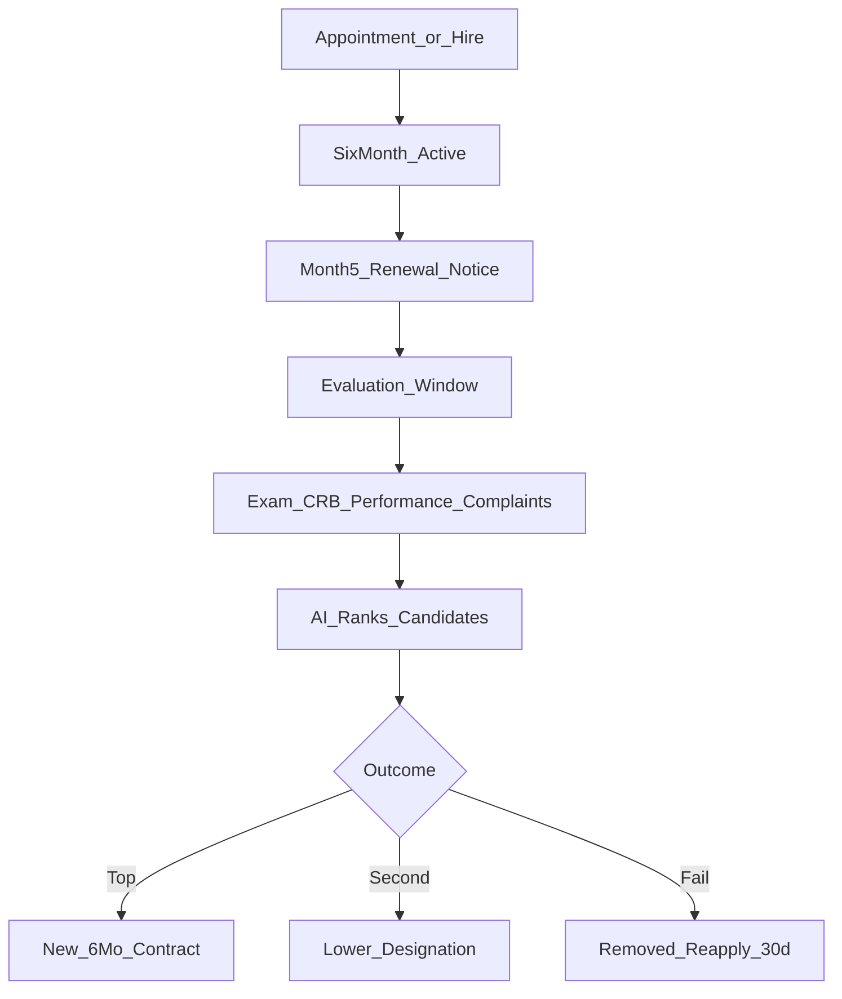

# FLOW-P4 — EHB-JPS workforce

## Metadata

| Field | Value |
|-------|--------|
| **Flow ID** | FLOW-P4 |
| **Title** | Job Provider System — roles, designations, contracts, STL ties, matching |
| **Status** | Draft |
| **Owner** | EHB design-flow |
| **Last updated** | 2026-04-07 |
| **Source plans** | [EHB_JPS_PLAN.md](../development/EHB_JPS_PLAN.md) |

## Summary

**EHB-JPS (Job Profile & Skill)** hiring, skills, aur workforce ka centre hai: har user ka **mandatory profile**, employers ↔ seekers ↔ skill providers, **merit-based designations** (6-month contracts + competition), aur data **STL** mein feed hota hai. Ye doc design-flow anchor hai; salary PKR bands plan mein reference hain — implementation region toggle baad mein.

## Roles (plan Part 2)

| Code | Description |
|------|-------------|
| JOB_SEEKER | Work/contracts dhoondhta hai |
| EMPLOYER | Hiring |
| FREELANCER | Independent |
| SKILL_PROVIDER | Training / trainers |
| INSPECTOR | CRB verification agent |
| DELIVERY_RIDER | GoSellr delivery |

## Designation L1–L7 ↔ STL gates (plan Part 3)

Universal ladder: Trainee → … → Executive. Industry-specific titles plan ki table mein (IT, healthcare, legal, etc.).

| Designation level | STL requirement (plan) | Notes |
|-------------------|------------------------|--------|
| L1 | None (entry) | — |
| L2 | STL L2 (score **40+**) | Engine L2 band: 40–59 [FLOW-P2](FLOW-P2-trust-stack.md) |
| L3 | STL L3 (**60+**) | L3: 60–74 |
| L4 | STL L4 (**75+**) | L4: 75–89 |
| L5 | L4+ + CRB Advanced | DMO involvement [FLOW-P3](FLOW-P3-dmo-governance.md) |
| L6 | L5 (**90+**) + CRB VIP | — |
| L7 | L5 + 5yr + Board | — |

## Six-month contract lifecycle (plan Part 4)

**Evaluation weights:** Exam 30% | AI performance 30% | CRB 20% | Complaints 10% | **STL 10%**.

**Exam flow (summary):** Day ~150 trigger → AI questions → proctored attempt → scores → JPS + STL history.

## Compensation snapshot (plan Part 5)

`Total = Fixed + Performance Bonus + STL Bonus + Commission`

**STL salary multiplier (on fixed):** L1 ×0.80 | L2 ×1.00 | L3 ×1.10 | L4 ×1.20 | L5 ×1.35 — plan Part 5; EHBGC settlement `EHB_WALLET_TOKEN_PLAN` (P6).

## AI job matching (plan Part 6)

Employer job post → AI extracts requirements (skills, STL min, PSS, CRB, etc.) → ranked shortlist → interview → offer → **6-month clock**.

**Weights (excerpt):** Skill 30% | Experience 20% | **STL 15%** | Location 10% | (remaining per plan).

## DMO touchpoints

- Designation **L5+** upgrades / exams / course approvals — [EHB_DMO_PLAN.md](../development/EHB_DMO_PLAN.md) JPS panel; [FLOW-P3](FLOW-P3-dmo-governance.md).
- Inspector misconduct → STL penalties (plan references).

## DMO app alignment

Workspace: `/dmo/jps` — views `profiles` | `skills` | `services` | `jobs` (`DmoSectionWorkspace`).

## Cross-flow links

| Topic | Doc |
|-------|-----|
| STL engine levels | [FLOW-P2-trust-stack.md](FLOW-P2-trust-stack.md) |
| DMO roles / RBAC | [FLOW-P3-dmo-governance.md](FLOW-P3-dmo-governance.md) |
| Naming | [GLOSSARY_EHB.md](GLOSSARY_EHB.md) |

## Open questions

- Designation STL thresholds use **engine** numeric bands — confirm same labels as HR-facing copy.
- UK salary bands vs PKR table — single source when multi-region launches.

## Traceability

| Plan file | Topics |
|-----------|--------|
| EHB_JPS_PLAN.md | Parts 1–6+ roles, designations, contracts, salary, matching, skills |

---

*FLOW-P4 | JPS design anchor for P5 GoSellr.*
