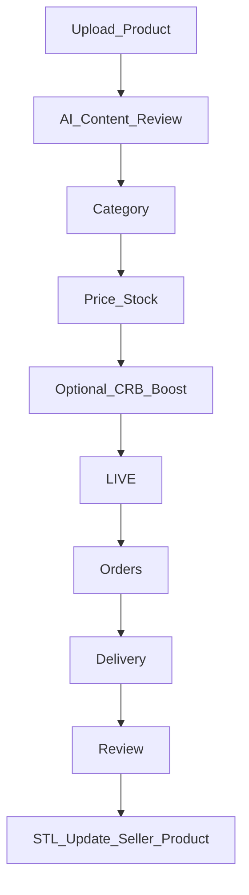
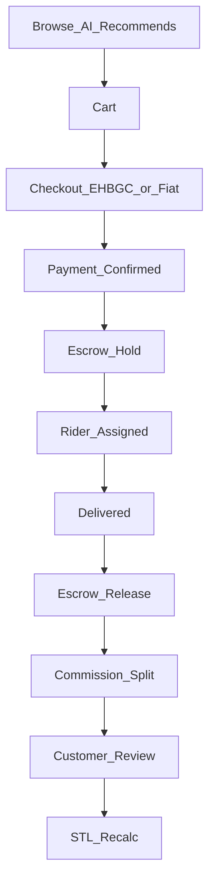

# FLOW-P5 — GoSellr GSM marketplace

## Metadata

| Field | Value |
|-------|--------|
| **Flow ID** | FLOW-P5 |
| **Title** | GoSellr GSM — sellers, products, orders, delivery, STL, commission |
| **Status** | Draft |
| **Owner** | EHB design-flow |
| **Last updated** | 2026-04-07 |
| **Source plans** | [EHB_GOSELLR_PLAN.md](../development/EHB_GOSELLR_PLAN.md) |

## Summary

**GoSellr GSM (Global Shopping Management)** EHB ka **multi-industry marketplace** hai: supply chain seller types, **STL-gated** listing rights, **product + seller STL**, AI search/recommendations, **order → escrow → delivery → review → STL recalc**, aur franchise/rider/affiliate **commission split**. Ye doc design anchor hai; wallet limits detail `EHB_WALLET_TOKEN_PLAN` (P6) se reconcile karenge.

## Seller hierarchy (plan Part 2)

Manufacturer → Authorized Dealer → Distributor → Wholesaler → Trader → Retailer/Storekeeper → Online Seller → Customer.

## STL → seller permissions (plan Part 3)

| STL | Listing |
|-----|---------|
| L1 | Cannot list |
| L2 | Up to 5 products |
| L3 | Unlimited, standard visibility |
| L4 | Featured eligible |
| L5 | Top placement, brand partner |

Bands: [FLOW-P2-trust-stack.md](FLOW-P2-trust-stack.md).

## Product lifecycle (plan Part 5)

**Product STL components (concept):** seller PSS, CRB, performance, reviews, behavior, refilling — engine alignment [FLOW-P2](FLOW-P2-trust-stack.md).

## Order flow (plan Part 7)

**Commission split (plan Part 8 — example):** EHB 10% | Sub 3% | Master 2% | Corporate 2% | Country 1% | Seller 70% | Rider 5% | Affiliate 7% (from platform share per plan). **Reconcile** with P7 franchise + P8 affiliate flow docs.

## Pricing (plan Part 6)

- Multi-level **markup** by seller type (manufacturer base → retailer +30% example).
- **Platform commission by STL:** L1–L2 15% | L3 12% | L4 10% | L5 7%.

## Delivery (plan Part 9)

AI assigns rider (location, STL, availability); rider STL rules (on-time +2, late −5, etc.). Types: EHB riders, 3rd party, self, digital.

## AI in GoSellr (plan Part 10)

Search ranking (STL + reviews + location + price), recommendations, fraud, translation, review authenticity, inventory alerts.

## Seller dashboard (plan Part 11)

Overview, products, orders, earnings, reviews, **STL**, growth, store, delivery, notifications.

## Scaling path (plan Part 12)

Online Seller L2 → Retailer → Wholesaler → Distributor → Dealer → Manufacturer Partner; multi-store / franchise store / brand partner at higher STL.

## Seller verification badges (plan Part 13)

Basic → Standard → Advanced (CRB) → Premium.

## Fraud penalties (plan Part 14)

Excerpt: fake product −30 STL; fake reviews −20; etc.

## Wallet (plan Part 15)

EHBGC; withdrawal limits by STL (L2–L5 table). **P6** wallet flow doc.

## DMO

GoSellr panel: listings, commissions, seller bans — [FLOW-P3-dmo-governance.md](FLOW-P3-dmo-governance.md).

## Cross-flow links

| Topic | Doc |
|-------|-----|
| STL engine / triggers | [FLOW-P2-trust-stack.md](FLOW-P2-trust-stack.md) |
| JPS riders / roles | [FLOW-P4-jps-workforce.md](FLOW-P4-jps-workforce.md) |
| Wallet / EHBGC | P6 `FLOW-P6-*` (pending) |
| Colors / badges | [FLOW-P1-foundation-ui.md](FLOW-P1-foundation-ui.md) |

## Open questions

- §2 **dynamic commission by STL** vs §1 order row — product decides precedence ([ECONOMICS_MASTER.md](ECONOMICS_MASTER.md)).

**Resolved:** Default order split — [ECONOMICS_MASTER.md](ECONOMICS_MASTER.md) §1; withdrawal limits — §5.

## Traceability

| Plan file | Topics |
|-----------|--------|
| EHB_GOSELLR_PLAN.md | Parts 1–17 hierarchy, STL, store, product, pricing, order, commission, delivery, AI, fraud, wallet, API sketch |

---

*FLOW-P5 | GoSellr design anchor for P6 Wallet.*
