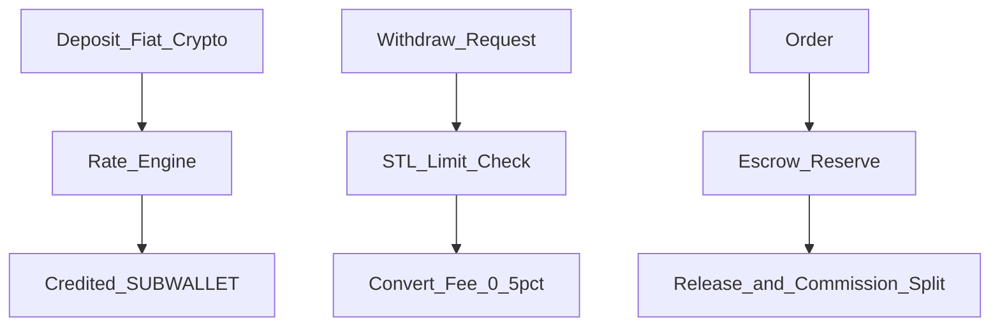

# FLOW-P6 — EHB wallet, EHBGC, EHBSC

## Metadata

| Field | Value |
|-------|--------|
| **Flow ID** | FLOW-P6 |
| **Title** | Sub-wallets, Trusty staking, deposits/withdrawals, STL limits, token overview |
| **Status** | Draft |
| **Owner** | EHB design-flow |
| **Last updated** | 2026-04-07 |
| **Source plans** | [EHB_WALLET_TOKEN_PLAN.md](../development/EHB_WALLET_TOKEN_PLAN.md) |

## Summary

EHB **EHW (EHB Wallet)** multiple **sub-wallets** use karta hai: MAIN, COIN (EHBGC), TRUSTY (lock/stake → trust + STL power), EARN (income), SETTLE (franchise). **EHBGC** utility/growth coin; **EHBSC** USD-pegged stable daily use. **Trusty** locking franchise/inspectors ke liye mandatory rules, buyers/sellers optional boost. **STL** withdrawal limits aur fraud/penalty flows yahan tie hote hain. Blockchain detail: [FLOW-P9-blockchain-trust.md](FLOW-P9-blockchain-trust.md) + [EHB_BLOCKCHAIN_PLAN.md](../development/EHB_BLOCKCHAIN_PLAN.md).

## Sub-wallets (plan Part 0)

| Code | Purpose |
|------|---------|
| MAIN | Spendable fiat-route balance (as product defines) |
| COIN | EHBGC storage + transfers |
| TRUSTY | Locked EHBGC → STL, ranking, validator eligibility |
| EARN | Sales / jobs / affiliate income |
| SETTLE | Franchise area payouts |

**Routing (Part 0):** earn → **EARN**; stake → **TRUSTY**; franchise payout → **SETTLE**; spend → MAIN / COIN.

**Decision (2026-04-07):** Part 0 sub-wallet model is **canonical**. Part 2B “all via Trusty” is **legacy copy** — operational earnings credit **EARN** (then user may **move** EHBGC to Trusty for staking). Mandatory franchise/inspector **locks** use **TRUSTY** only.

## EHBGC vs EHBSC (plan Part 1)

| Token | Role |
|-------|------|
| EHBGC | Utility, staking, governance, growth, tradable |
| EHBSC | 1:1 USD peg; salaries/stable payments |

## Trusty Wallet (plan Part 2)

- **Mandatory lock:** Franchise operators, Inspectors; **optional** sellers, riders, buyers (boost).
- **Rewards:** tiered by lock period (0.5%–1.1% / month example) — requires validator active, account active, **STL ≥ L2**, no complaint lock.
- **Benefits:** STL boost, AI priority, income share, validator path (10k+ EHBGC).
- **Penalties:** fraud → deduct / freeze lock → STL drop.

## Core money flows (plan Part 3)

**Internal order:** reserve EHBGC → fulfill → release seller + platform/franchise/affiliate splits — aligns [FLOW-P5](FLOW-P5-gosellr-marketplace.md).

## Withdrawal limits by STL (plan Part 6)

| STL | Daily |
|-----|--------|
| L1 | Blocked |
| L2 | PKR 10k / £50 / ~$65 |
| L3 | PKR 50k / £250 / ~$315 |
| L4 | PKR 200k / £1k / ~$1.26k |
| L5 | Unlimited |

**Requirements:** PSS minimum layers, verified payout method, no complaint lock, no STL freeze, AML clear — same spirit as [FLOW-P2](FLOW-P2-trust-stack.md).

## Deposits / regions (plan Part 4–5)

Stripe, PayPal, JazzCash, EasyPaisa, banks, Binance Pay, Mosaic, USDT, wire — PKR/GBP/USD/EHBGC etc.

## Staking (plan Part 8)

Lock tiers (7d–365d APY table); **temporary STL boost** by staked amount (+2 to +15) with duration caps — display separate from base STL in UI.

## Validators (plan Part 9 — sketch)

Min **10,000 EHBGC**, STL **L4+**, full PSS, CRB advanced+, uptime — full spec in wallet plan + blockchain plan.

## Tokenomics pointer (plan Part 7)

1B EHBGC cap, distribution buckets, burn triggers (GoSellr 0.1%, PSS/CRB fees, penalties 100%, etc.), EHBSC mint/burn vs USDT — **no duplication here**; engineering reads source plan.

## DMO

Wallet & AML panel — [FLOW-P3-dmo-governance.md](FLOW-P3-dmo-governance.md).

## Cross-flow links

| Topic | Doc |
|-------|-----|
| GoSellr order/escrow/commission | [FLOW-P5-gosellr-marketplace.md](FLOW-P5-gosellr-marketplace.md) |
| STL engine / fraud | [FLOW-P2-trust-stack.md](FLOW-P2-trust-stack.md) |
| Franchise settlement | [FLOW-P7-franchise-network.md](FLOW-P7-franchise-network.md) |
| On-chain architecture | P9 + `EHB_BLOCKCHAIN_PLAN.md` |

## Open questions

- STL **withdrawal** table vs `EHB_STL_FULL_PLAN` wallet section — keep aligned with [ECONOMICS_MASTER.md](ECONOMICS_MASTER.md) §5.
- EHBGC/EHBSC checkout UX: user choice per order (plan Part 1) — wire in P11 E2E.

**Resolved:** EARN vs Trusty — see **Routing** above. Affiliate EHBGC: credit **EARN** (pending → available), not Trusty, unless user stakes into Trusty ([FLOW-P8](FLOW-P8-affiliate-complaints.md)).

## Traceability

| Plan file | Topics |
|-----------|--------|
| EHB_WALLET_TOKEN_PLAN.md | v2.0 Parts 0–9+ sub-wallets, tokens, flows, limits, tokenomics, staking, validators |

---

*FLOW-P6 | Wallet design anchor for P7 Franchise.*
