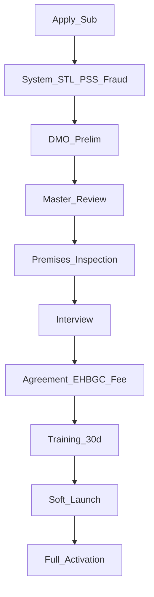

# FLOW-P7 — EHB franchise network

## Metadata

| Field | Value |
|-------|--------|
| **Flow ID** | FLOW-P7 |
| **Title** | Hierarchy, earnings, CRB routing, STL coupling, application & renewal |
| **Status** | Draft |
| **Owner** | EHB design-flow |
| **Last updated** | 2026-04-07 |
| **Source plans** | [EHB_FRANCHISE_PLAN.md](../development/EHB_FRANCHISE_PLAN.md) |

## Summary

**EHB Franchise** real-world coverage deta hai: **HO → Country → Corporate → Master → Sub**; revenue **up**, responsibility **down**. Sub/Master/Corporate roles **CRB**, riders, complaints, **STL enforcement** sambhalte hain. **Per-order %** GoSellr plan se match — [FLOW-P5](FLOW-P5-gosellr-marketplace.md). **Trusty mandatory lock** franchise operators ke liye — [FLOW-P6](FLOW-P6-wallet-token.md).

## Hierarchy (plan Part 2)

```
Head_Office → Country → Corporate (×25 Master each) → Master (×25 Sub each) → Sub → Inspectors_Riders_Staff
```

**Capacity:** 1 Corporate = 625 Subs (25×25).

## Level snapshot (plan Part 3)

| Level | STL gate (typical) | Earning note |
|-------|-------------------|--------------|
| Sub | L3+, PSS+CRB Std | 3% area tx; inspection share |
| Master | L4+, CRB Adv | 2% area; Sub oversight |
| Corporate | L5+, CRB VIP | 2% regional |
| Country | Invited | 1% national |
| HO | Super admin | Policy, 10% platform in order split |

## Order revenue split (plan Part 4 vs P5)

Franchise plan table: HO **10%** | Country **1%** | Corporate **2%** | Master **2%** | Sub **3%** | Seller **70%** | Rider **5%** | Affiliate **7%*** (*from EHB share per plan). **Align** with [FLOW-P5](FLOW-P5-gosellr-marketplace.md) open question — one locked table for product.

**CRB inspection fee split:** Sub 50% | Master 20% | Corporate 15% | Country 10% | HO 5%.

**Franchise fee waterfall:** Sub fee → Master; Master → Corporate; Corporate → Country + HO (detail in source plan).

## CRB routing (plan Part 5)

GPS → eligible Subs → exclude last-used → inspector available → rank by performance + STL → **random from top 5** → assign inspector → audit log.

**Edge:** no franchise in country → CRB not possible, **STL capped L2** (plan).

## Franchise ↔ STL (plan Part 6)

Upward influence: Sub STL → local user cap / CRB weight; Master → Sub cap; Corporate → regional multiplier.

**Low STL effects:** e.g. &lt;40 cannot onboard sellers; &lt;60 cannot run CRB inspections; freezes pause ops.

## Compliance KPIs (plan Part 7)

AI monitors complaint SLA, CRB accuracy, rider on-time, retention, reporting — STL penalties (e.g. −5, −10). Suspension triggers: STL &lt;40, fraud, missed reports, etc.

## DMO / dashboards (plan Part 8)

Role-based: own performance, sub-units, STL override, CRB approval tier, complaint tier, revenue scope — full matrix in plan; DMO panel [FLOW-P3](FLOW-P3-dmo-governance.md), workspace `/dmo/franchise`.

## Sub application flow (plan Part 9)



## Renewal (plan Part 10)

6-month evaluation: complaints, CRB accuracy, revenue, STL, inspectors, DMO audit — outcomes from bonus to removal / re-tender.

## Cross-flow links

| Topic | Doc |
|-------|-----|
| Order/escrow/split | [FLOW-P5-gosellr-marketplace.md](FLOW-P5-gosellr-marketplace.md) |
| Trusty / franchise mandatory stake | [FLOW-P6-wallet-token.md](FLOW-P6-wallet-token.md) |
| CRB + STL engine | [FLOW-P2-trust-stack.md](FLOW-P2-trust-stack.md) |
| DMO governance | [FLOW-P3-dmo-governance.md](FLOW-P3-dmo-governance.md) |
| JPS 6-month competition | [FLOW-P4-jps-workforce.md](FLOW-P4-jps-workforce.md) |

## Open questions

- Country Franchise count per country (N corporates) vs capacity formula — product param.

**Resolved:** Order % — [ECONOMICS_MASTER.md](ECONOMICS_MASTER.md) §1.

## Traceability

| Plan file | Topics |
|-----------|--------|
| EHB_FRANCHISE_PLAN.md | Parts 1–11 hierarchy, earnings, CRB routing, STL, compliance, dashboards, application, renewal |

---

*FLOW-P7 | Franchise design anchor for P8 Affiliate + Complaint.*
