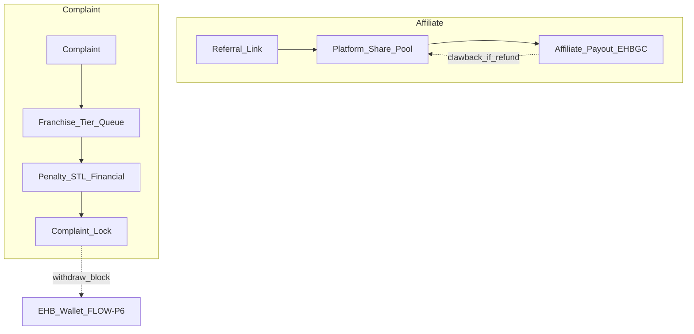

# FLOW-P8 — Affiliate network + complaints & penalties

## Metadata

| Field | Value |
|-------|--------|
| **Flow ID** | FLOW-P8 |
| **Title** | EHB-EAP referrals + CMS escalation, locks, refunds, STL penalties |
| **Status** | Draft |
| **Owner** | EHB design-flow |
| **Last updated** | 2026-04-07 |
| **Source plans** | [EHB_AFFILIATE_PLAN.md](../development/EHB_AFFILIATE_PLAN.md), [EHB_COMPLAINT_PENALTY_PLAN.md](../development/EHB_COMPLAINT_PENALTY_PLAN.md) |

## A. Affiliate (EHB-EAP)

### Principle

Commission **platform share** se — seller/buyer ke 70% ko touch nahi karta ([EHB_AFFILIATE_PLAN.md](../development/EHB_AFFILIATE_PLAN.md) Part 1). [FLOW-P5](FLOW-P5-gosellr-marketplace.md) order split ke sath align: EHB **10%** pool se affiliate **7%** narrative (exact rows P5/P7 economics sheet se lock karein).

### Eligibility (excerpt)

| User type | When eligible |
|-----------|----------------|
| Buyer | PSS L1+ |
| Seller | STL L2+ |
| Franchise | Auto |
| Job seeker | PSS complete |
| Inspector / Rider | Role / PSS |

### 4-level network

L1 direct **5%** | L2 **2%** | L3 **1%** | L4 **0.5%** — each applied to **EHB platform share**, not seller 70%.

### Tracking

`ehb.io/join?ref=...` — cookie, **30-day** attribution, **last click wins**, lifetime link after signup, self-referral blocked.

### STL × affiliate

| STL | Network depth / notes |
|-----|------------------------|
| L1 | Basic; no multi-level |
| L2 | L1+L2 |
| L3 | +L3 |
| L4 | Full 4 levels |
| L5 | Full + VIP multipliers |

**Earning multipliers:** L2 1.0× | L3 1.1× | L4 1.2× | L5 1.5×.

### Payout

Earnings → **Trusty / EHBGC** path per plan: pending → available, clawback on refund/ban — detail [FLOW-P6](FLOW-P6-wallet-token.md). *Affiliate plan says Trusty Wallet — confirm vs EARN sub-wallet in wallet master doc.*

---

## B. Complaints & penalties (EHB-CMS)

### Escalation tiers (plan Part 2)

Tier 0 User → Tier 1 **Sub** (2h) → Tier 2 **Master** (4h) → Tier 3 **Corporate** (6h) → Tier 4 **Country** (12h) → Tier 5 **HO** (24h) → Tier 6 **PSS Authority** (fraud). Auto-escalate on SLA breach.

### Lifecycle (summary)

Submit → AI pre-screen → franchise review → mediation → decision (penalty, STL, refund) → **48h appeal** → record (hash if severe).

### Penalty engine (excerpt)

**STL:** fake product −30; non-delivery −30; fake reviews −20; franchise no-response −5; inspector fake CRB −50; bribery −100 + ban — full table in source plan.

**Financial:** escrow refunds, freezes, withholds.

**Account:** warnings → restriction → STL freeze → ban / blacklist.

### Complaint locks (Part 7)

Soft (withdraw block) → Medium (list/jobs) → Hard (tx pause) → Full freeze (read-only). Releases per resolution / DMO / PSS.

### Refunds (Part 8)

Buyer-wins path: source escrow/seller/rider → EHBGC to buyer → **commission reversal** → STL update — ties [FLOW-P5](FLOW-P5-gosellr-marketplace.md).

### Franchise mishandling (Part 10)

Miss SLA −5 STL; biased resolution −20; suppression −30 + suspension — [FLOW-P7](FLOW-P7-franchise-network.md).

### Dashboards (Part 11)

User | Franchise (tier queue + SLA) | DMO (global + analytics).

---

## Combined diagram (conceptual)

## Cross-flow links

| Topic | Doc |
|-------|-----|
| Order split / affiliate % | [FLOW-P5](FLOW-P5-gosellr-marketplace.md), [FLOW-P7](FLOW-P7-franchise-network.md) |
| Wallet / pending / Trusty | [FLOW-P6](FLOW-P6-wallet-token.md) |
| STL updates | [FLOW-P2](FLOW-P2-trust-stack.md) |
| DMO | [FLOW-P3](FLOW-P3-dmo-governance.md) |

## Open questions

- Complaint **screen labels** vs franchise org chart — use plain language (“Sub franchise first response”) alongside tier numbers if needed.

**Resolved:** Order + affiliate economics — [ECONOMICS_MASTER.md](ECONOMICS_MASTER.md). Affiliate EHBGC → **EARN** ([FLOW-P6](FLOW-P6-wallet-token.md)).

### Complaint tier ↔ handler (for dev enums)

| Tier | Handler |
|------|---------|
| 0 | User self-service |
| 1 | Sub Franchise |
| 2 | Master Franchise |
| 3 | Corporate Franchise |
| 4 | Country Franchise |
| 5 | Head Office |
| 6 | PSS Authority (fraud/identity) |

## Traceability

| Plan file | Section |
|-----------|---------|
| EHB_AFFILIATE_PLAN.md | Parts 1–8+ tiers, tracking, STL, payment |
| EHB_COMPLAINT_PENALTY_PLAN.md | Parts 1–12 escalation, penalties, locks, refunds, AI |

---

*FLOW-P8 | Growth + trust enforcement anchor for P9 blockchain.*
